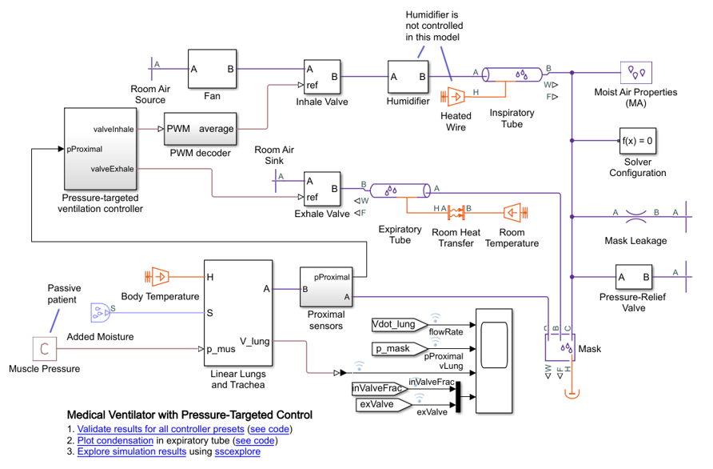

# **Ventilator Example with Closed-Loop Control on Low Cost Hardware**
## **Overview**
This example models a positive-pressure medical ventilator system using Simscape™. It provides a starting point for designers working on ventilators. It shows how to interface a real-time controller and a system model, how to define a real-time controller in Simulink® and Stateflow™, and how a full system model supports the design process. The model includes the patient’s lungs and trachea, the ventilator device with valves and tubes, and a pressure-targeted ventilator controller.

This example shows how a simple controller can be built on a readily available Arduino device (Simulink Support Package for Arduino required). It is also intended to illustrate programming patterns useful in building embedded controllers of this type.

## **Getting Started**
1. Open the project file Ventilator.prj. 
2. Open medicalVentilatorSystemModel.slx, simulate and inspect the logged data and scopes. 
3. Opening controlArduino.slx and press the build icon to test the hardware build process
4. To run the model at four dial settings and see performance run plotResults.m.

You will need at least MATLAB, Simulink, Simscape, and Stateflow to run this example.

### **Disclaimer**
This is intended as an example for people to build on if they are working on ventilator projects and is not a working design in itself.

This example may not represent an implementable design, and no validation has been done. The purpose of the example is to provide a starting point for designers working on ventilators showing how interfacing between the real-time controller and the system model can be done, how a real-time controller can be defined in Simulink® and Stateflow™ and how a full system model can be used to support the design process.

## **Contents**

### **Ventilator Model: medicalVentilatorSystemModel.slx**
The simulation of the ventilator physical model and its control. Run this model to simulate the controller. You can also use the Simulation Data Inspector to see internal measurements from the controller once the simulation has finished.

### **Parameters: medicalVentilatorSystemParams.m**
This is a MATLAB file that contains some of the ventilator and lung parameters you would want to tune as the control device is developed. If a user/developer is familiar with Simulink Data Dictionaries, then best practice would be to migrate these parameters to a Simulink Data Dictionary.

### **Control Model: controlModel.slx**
This is the model of just the controller. It is referenced from the other models. The model contains annotations to help the reader understand the purpose of the different parts of the controller. This model also has a test harness on the top level for open-loop testing of the controller.

### **Parameters controlParams.m**
This is a MATLAB file that contains some of the control parameters you would want to tune as a device of this type is developed. If a user/developer is familiar with Simulink Data Dictionaries, then best practice would be to migrate these parameters to a Simulink Data Dictionary.

### **Library: controlLibrary.slx**
The controller uses some blocks repeatedly, such as filters. Blocks that are repeated should be stored in a library so they can be edited in one place.
 
### **Model: controlArduino.slx**
This is a model that is used to build the code that can be deployed onto the Arduino hardware (Mega 2560, but would probably work on other boards too). This builds a hex file that can be programmed onto the device.
